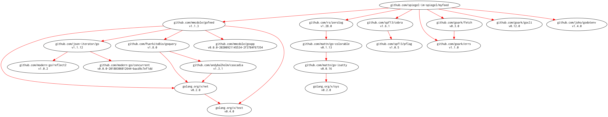

# [myfeed] -- Manage my feed

[](https://github.com/spiegel-im-spiegel/myfeed/actions)
[](https://github.com/spiegel-im-spiegel/myfeed/actions)
[](https://raw.githubusercontent.com/spiegel-im-spiegel/myfeed/master/LICENSE)
[](https://github.com/spiegel-im-spiegel/myfeed/releases/latest)

## Download and Build

```
$ go install github.com/spiegel-im-spiegel/myfeed@latest
```

### Binaries

See [latest release](https://github.com/spiegel-im-spiegel/myfeed/releases/latest).

## Usage

```
$ feed -h
Manage my feed

Usage:
  myfeed [flags]
  myfeed [command]

Available Commands:
  completion  Generate the autocompletion script for the specified shell
  help        Help about any command
  version     print the version number

Flags:
      --debug   for debug
  -h, --help    help for myfeed

Use "myfeed [command] --help" for more information about a command.
```

## Modules Requirement Graph

[](./dependency.png)

[myfeed]: https://github.com/spiegel-im-spiegel/myfeed "spiegel-im-spiegel/myfeed: Manage my feed"
